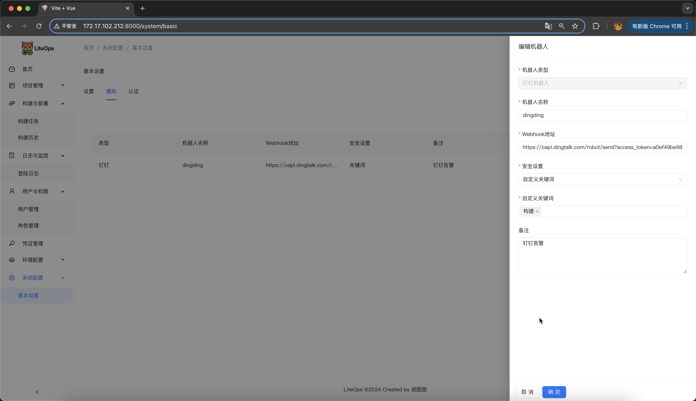
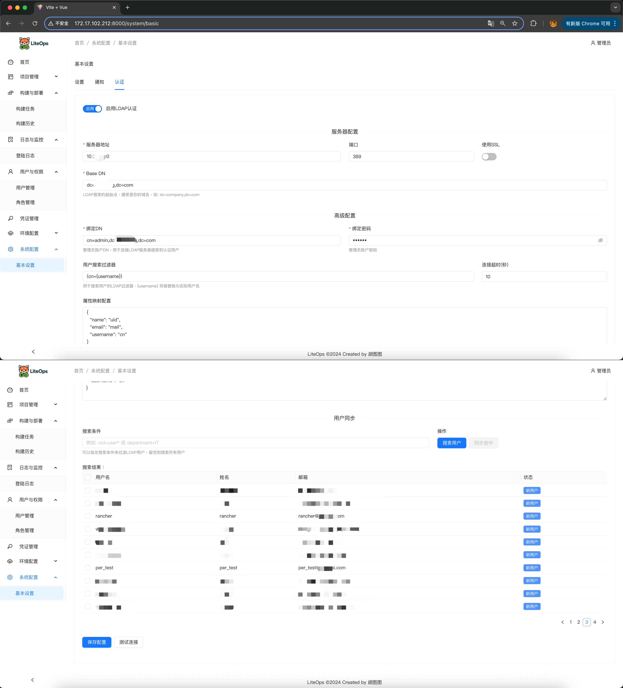

<div align="center">

# 🚀 LiteOps - 轻量级DevOps平台


**简单、高效的CI/CD解决方案**

</div>

<p align="center">
  
  
  
  
  
</p>


# 项目介绍
**注意根据GitHub源码内容为最新版本，官网和DockerHub更新稍慢**

## LiteOps CICD 平台概述

LiteOps 是一个专注实用性的 CI/CD 平台。只解决真问题 —— 自动化构建、部署 一体化平台。

## 项目特点

- **够用就好**：基于实际工作流程设计，没有复杂功能
- **上手简单**：界面直观，学习成本低，像 Jenkins 自由风格 Job 一样简单
- **针对痛点**：专门解决团队缺失的环节

## 功能预览

<table align="center" width="100%">
  <tr>
    <td align="center" width="50%">
      
    </td>
    <td align="center" width="50%">
      
    </td>
  </tr>
  <tr>
    <td align="center">
      
    </td>
    <td align="center">
      
    </td>
  </tr>
  <tr>
    <td align="center">
      
    </td>
    <td align="center">
      
    </td>
  </tr>
  <tr>
    <td align="center">
      
    </td>
    <td align="center">
      
    </td>
  </tr>
  <tr>
    <td align="center">
      
    </td>
    <td align="center">
      
    </td>
  </tr>
  <tr>
    <td align="center">
      
    </td>
    <td align="center">
      
    </td>
  </tr>
</table>

## 技术架构

LiteOps采用前后端分离的架构设计：

### 前端技术栈

- **Vue 3**：渐进式JavaScript框架
- **Ant Design Vue 4.x**：基于Vue的UI组件库
- **Axios**：基于Promise的HTTP客户端
- **Vue Router**：Vue官方路由管理器
- **echarts**：数据可视化图表库

### 后端技术栈

- **Django 4.2**：Python Web框架
- **Django Channels**：WebSocket支持
- **MySQL 8**：关系型数据库
- **GitPython**：Git操作库
- **Python-GitLab**：GitLab API客户端
- **JWT认证**：用户身份验证

## 项目目标

1. 把重复性、手动上传的构建部署工作自动化掉
2. 减少人为操作错误，标准化流程  
3. 提供清晰的构建状态和日志，出问题能快速定位

## 📋 源码部署 （推荐）

如果你想从源码运行 LiteOps，可以按照以下步骤操作：

### 环境要求

- **Python**：3.9+
- **Node.js**：18+
- **MySQL**：8.0+
- **Git**：用于克隆源码

### 1. 克隆项目

```bash
git clone https://github.com/opsre/LiteOps.git
cd LiteOps
```

### 2. 后端部署

```bash
# 进入后端目录
cd backend

# 安装 Python 依赖
pip3 install -r requirements.txt

# 配置数据库（请先创建数据库并导入 liteops_init.sql）
#可自定义修改 backend/config.txt 中的数据库配置文件
cat backend/config.txt
[client]
host = 127.0.0.1  # 自定义IP
port = 3306   # 自定义端口
database = liteops
user = root
password = 1234567xx # 自定义密码
default-character-set = utf8mb4
```

```bash
# 启动后端服务
python3 -m uvicorn backend.asgi:application --host 0.0.0.0 --port 8900
```

### 3. 前端部署

```bash
# 新开终端，进入前端目录
cd web

# 安装依赖
npm i
# 或者
npm install

# 开发模式启动
npm run dev

# 生产环境构建（dist静态文件）
npm run build
```

### 4. 一键启动脚本（可选）

为了方便启动，我提供了一个启动脚本来同时启动前后端服务：

```bash
# 给启动脚本执行权限
chmod +x start.sh

# 执行一键启动（同时启动前端和后端）
./start.sh
```

启动脚本会：
- 检查端口占用情况（8900、8000端口）
- 自动安装缺失的依赖
- 自动启动后端服务（端口8900）
- 自动启动前端开发服务器（端口8000）
- 支持优雅停止（Ctrl+C时自动清理进程）

### 5. 访问应用

- **开发模式**：
  - 前端：http://localhost:8000
  - 后端：http://localhost:8900
  
- **生产模式**：
  - 配置 Nginx Web 服务器托管前端构建文件
  - 后端接口 http://localhost:8900

### 注意事项

- 确保 MySQL 服务正常运行，并已导入初始化 SQL 文件
- 修改前端 API 地址配置以匹配后端服务地址

## 🚀 Docker快速部署（比较臃肿，使用了DinD模式，懂哥可自定义Dockerfile构建）

如果你希望快速体验LiteOps而不想配置开发环境，可以使用Docker方式部署：

### 1. 获取部署文件

你需要获取以下部署文件：

- `start-containers.sh` - 一键部署脚本
- `liteops_init.sql` - 数据库初始化文件
- `liteops` - Docker镜像

### 2. 获取Docker镜像

```bash
# 拉取LiteOps镜像
docker pull liteops/liteops:[最新版本号]
```

### 3. 准备部署文件

创建部署目录并放置必要文件：

```bash
# 创建部署目录
mkdir liteops-deploy
cd liteops-deploy

# 将以下文件放入此目录：
# - start-containers.sh
# - liteops_init.sql
```

### 4. 一键部署

使用提供的启动脚本进行自动化部署：

```bash
# 给启动脚本执行权限
chmod +x start-containers.sh

# 执行一键部署
./start-containers.sh
```
### 5. 不使用一键部署方式，自定义数据库

#### 方案A：配置文件挂载方式

```bash
# 1. 先启动MySQL容器（可自定义mysql）
docker run -d \
    --name liteops-mysql \
    -e MYSQL_ROOT_PASSWORD=your_password \
    -p 3306:3306 \
    mysql:8.0

# 等待MySQL启动完成后导入初始化数据（会自动创建liteops数据库）
docker exec -i liteops-mysql mysql -uroot -pyour_password < liteops_init.sql

# 2. 在宿主机创建配置文件
mkdir -p ./liteops-config
cat > ./liteops-config/config.txt << EOF
[client]
host = 数据库IP  # 如果使用Docker网络，填写容器名
port = 3306
database = liteops
user = root
password = your_password  # 替换为您的实际密码
default-character-set = utf8mb4
EOF

# 3. 启动LiteOps容器，挂载配置文件
docker run -d \
    --name liteops \
    --privileged \
    -p 80:80 \
    -p 8900:8900 \
    -v $(pwd)/liteops-config/config.txt:/app/backend/conf/config.txt \
    liteops/liteops:[最新版本]
```

配置文件 `config.txt`：
```ini
[client]
host = 数据库IP
port = 3306
database = liteops
user = root
password = your_password
default-character-set = utf8mb4
```

### 6. 验证部署

部署完成后，你可以通过以下方式验证：

```bash
# 检查容器状态
docker ps

# 检查日志
docker logs liteops
```

### 访问应用

部署成功后，你可以通过以下地址访问：

- **前端界面**：http://localhost
- **后端API**：http://localhost:8900/api/
- **MySQL数据库**：localhost:3306

### 默认登录信息

- **用户名**：admin
- **密码**：admin123 (初始密码，可自行修改)

## 项目当前状态

LiteOps目前处于很多功能未完善状态，虽然核心功能已经初步实现，但仍有许多需求和功能有待完善，。我希望通过开源的方式收集更多的需求和建议，使这个项目能够更好地服务于实际开发场景。

### 需求征集

我诚挚邀请你在查看[功能介绍文档](https://liteops.ext4.cn)和了解LiteOps后，提供宝贵的意见和建议：

功能介绍文档：https://liteops.ext4.cn

- **功能需求**：你希望看到哪些新功能或改进？
- **用户体验**：界面和操作流程是否符合你的使用习惯？
- **实际场景**：在你的工作环境中，有哪些CI/CD痛点尚未解决？

## 📞 联系我

如果你对LiteOps有任何建议、问题或需求，欢迎通过以下方式联系我：

- **邮箱**：hukdoesn@163.com
- **GitHub Issues**：[提交问题或建议](https://github.com/hukdoesn/liteops/issues)


---

[](https://www.star-history.com/#opsre/LiteOps&Date)