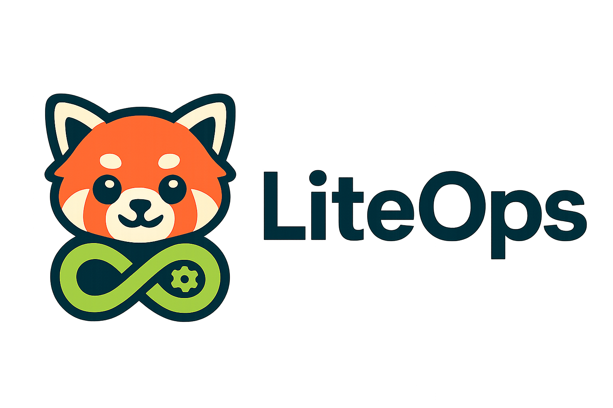
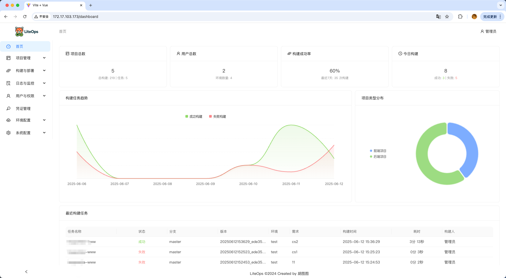
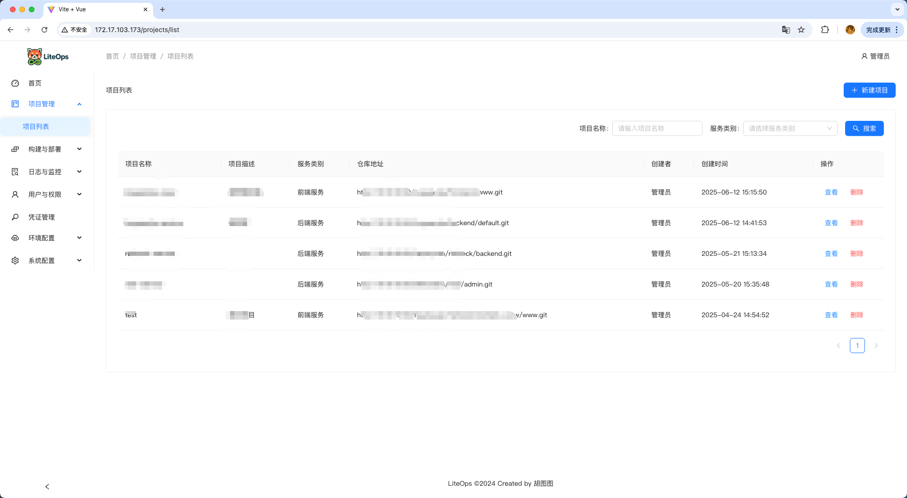
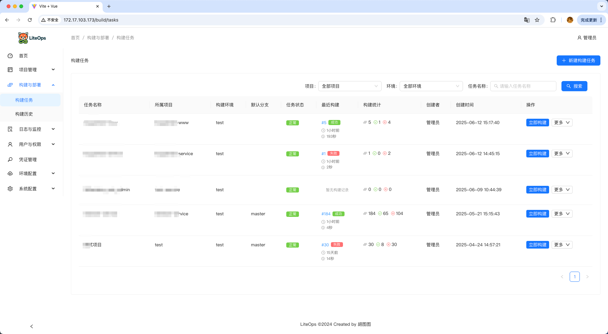
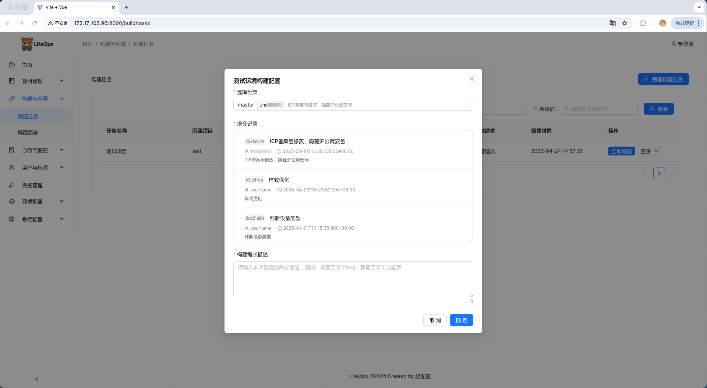
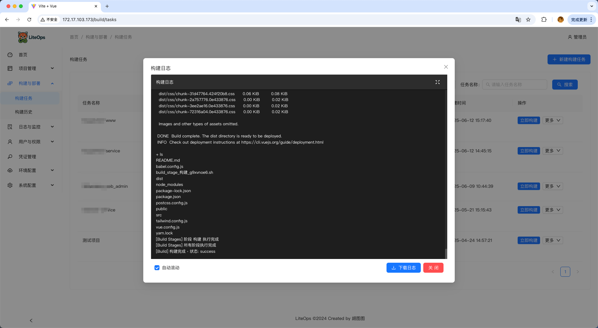
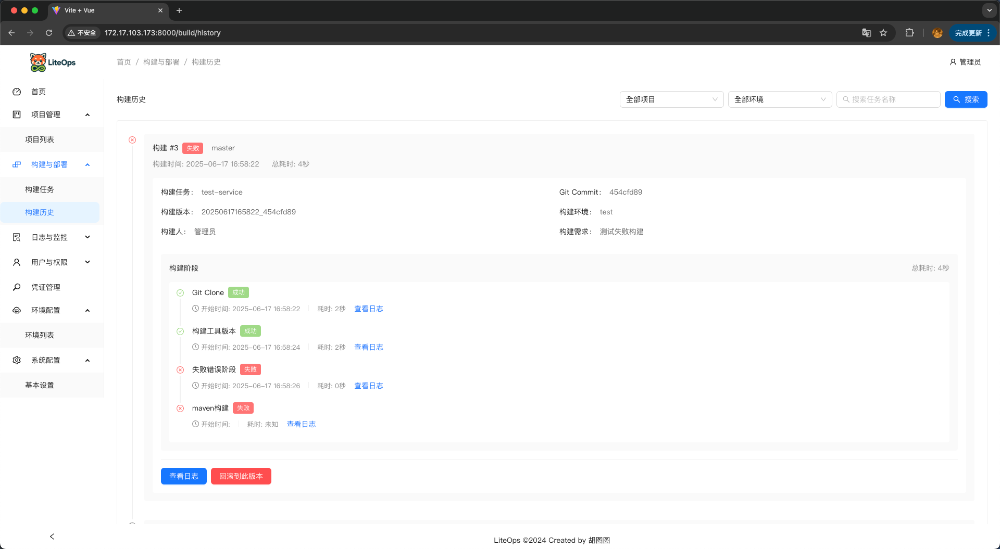
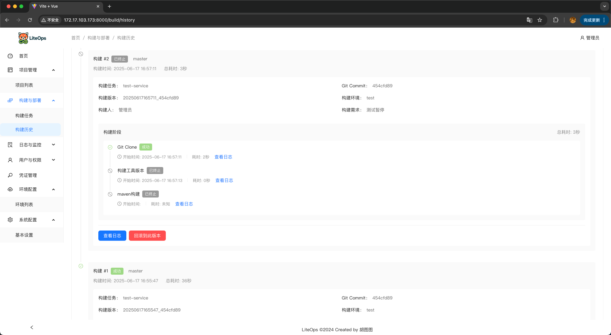
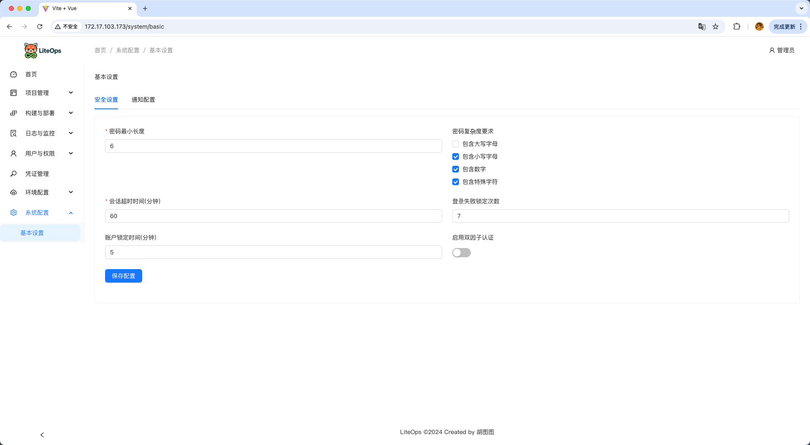
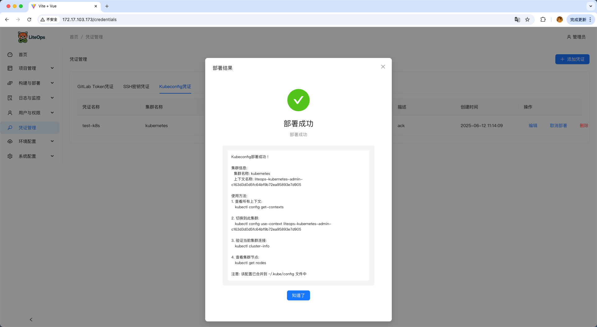

<div align="center">

# 🚀 LiteOps - 轻量级DevOps平台



**简单、高效的CI/CD解决方案**

</div>

<p align="center">
  
  
  
  
</p>

# 项目介绍

## LiteOps CICD 平台概述

LiteOps是一个实用型的CI/CD平台。它并非追求大而全的DevOps解决方案，而是聚焦于团队日常工作中真正需要的自动化构建、和部署功能，帮助开发团队提高效率，减少重复性工作。

## 项目特点

LiteOps的核心特点是"实用、贴合需求、易于使用"：

- **实用为先**：基于公司现有流程开发，解决实际问题，没有多余花里胡哨功能
- **贴合需求**：针对团队缺少的功能进行定制开发，填补工作流程中的空白
- **易于使用**：简洁直观的界面设计，降低使用门槛，减少学习成本，倾向于Jenkins 自由风格Job

## 功能预览

<table align="center" width="100%">
  <tr>
    <td align="center" width="50%">
      
      <p><strong>系统仪表板</strong><br/>整体概览，快速查看系统状态</p>
    </td>
    <td align="center" width="50%">
      
      <p><strong>项目管理</strong><br/>统一管理所有项目</p>
    </td>
  </tr>
  <tr>
    <td align="center">
      
      <p><strong>构建任务</strong><br/>手动触发构建</p>
    </td>
    <td align="center">
      
      <p><strong>构建需求</strong><br/>填写构建需求</p>
    </td>
  </tr>
  <tr>
    <td align="center">
      
      <p><strong>构建日志</strong><br/>实时查看构建过程和结果</p>
    </td>
    <td align="center">
      
      <p><strong>构建历史</strong><br/>阶段错误状态追踪</p>
    </td>
  </tr>
  <tr>
    <td align="center">
      
      <p><strong>构建详情</strong><br/>暂停状态追踪</p>
    </td>
    <td align="center">
      
      <p><strong>构建历史日志</strong><br/>详细日志记录</p>
    </td>
  </tr>
  <tr>
    <td align="center">
      
      <p><strong>系统基础设置</strong><br/>灵活的系统配置管理</p>
    </td>
    <td align="center">
      
      <p><strong>凭据管理</strong><br/>安全的凭据和配置文件管理</p>
    </td>
  </tr>
</table>

## 项目背景

在日常开发工作中，我发现现有的工作流程存在一些功能缺失。市面上的CI/CD工具虽然功能丰富，但往往存在以下问题：

1. 与公司现有流程不匹配，需要大量定制。比如我们不允许自动化构建（webhook调用），只允许测试手动构建，便于知道发布之后修改了什么功能/bug。
2. 功能过于复杂，团队实际只需要其中一小部分
3. 学习和维护成本高（Jenkins Pipeline）
4. 难以满足团队特定的自动化需求

LiteOps正是基于这些实际问题开发的，它不追求"高大上"的全面解决方案，而是专注于解决团队日常工作中的实际痛点，提供刚好满足需求的功能。更多的是发布记录功能。如：测试去构建的时候需要去填写构建需求、可观测发布分支最后提交人以及提交commit记录。

## 技术架构

LiteOps采用前后端分离的架构设计：

### 前端技术栈

- **Vue 3**：渐进式JavaScript框架
- **Ant Design Vue 4.x**：基于Vue的UI组件库
- **Axios**：基于Promise的HTTP客户端
- **Vue Router**：Vue官方路由管理器
- **echarts**：数据可视化图表库

### 后端技术栈

- **Django 4.2**：Python Web框架
- **Django Channels**：WebSocket支持
- **MySQL 8**：关系型数据库
- **GitPython**：Git操作库
- **Python-GitLab**：GitLab API客户端
- **JWT认证**：用户身份验证

### 部署架构

LiteOps采用容器化部署方案，主要包含以下组件：

```
┌─────────────────────┐    ┌─────────────────────┐
│   Nginx (Port 80)   │    │  Django (Port 8900) │
│   静态文件服务        │◄───┤  后端API服务         │
└─────────────────────┘    └─────────────────────┘
                                       │
                           ┌─────────────────────┐
                           │  MySQL (Port 3306)  │
                           │  数据库服务          │
                           └─────────────────────┘
                                       │
                           ┌─────────────────────┐
                           │  Docker in Docker   │
                           │  CI/CD构建环境       │
                           └─────────────────────┘
```

**部署特点**：
- **Docker**：容器化部署，环境一致性
- **Docker in Docker**：支持CI/CD构建环境，完全隔离
- **一键部署**：自动化脚本部署，简化操作流程
- **多阶段构建**：优化镜像大小，提高构建效率

## 项目目标

LiteOps的目标是解决团队在开发流程中的实际问题，具体包括：

1. 自动化团队中重复性高的构建和部署工作，节省人力成本
2. 标准化项目的构建流程，减少人为错误
3. 提供清晰的构建状态和日志，方便问题排查
4. 支持团队特有的部署需求，适应现有的服务器环境
5. 简化权限管理

## 适用场景

LiteOps主要适用于以下场景：

- 需要解决特定CI/CD痛点的开发团队
- 现有流程中缺少自动化构建和部署环节的项目
- 希望减少手动操作、提高效率的开发环境
- 对现有工具不满意，需要更贴合实际工作流程的解决方案

## 🚀 快速部署

### 前置要求

在开始部署之前，请确保您的系统满足以下要求：

- **操作系统**：Linux (推荐 Ubuntu 20.04+、CentOS 7+)
- **Docker**：版本 20.0+ 
- **Docker Compose**：版本 2.0+
- **磁盘空间**：至少 5GB 可用空间
- **内存**：推荐 4GB
- **网络**：能够访问 Docker Hub 和相关软件源

### 快速开始

#### 1. 获取部署文件

您需要获取以下部署文件：

- `start-containers.sh` - 一键部署脚本
- `liteops_init.sql` - 数据库初始化文件
- `liteops` - Docker镜像

#### 2. 获取Docker镜像

```bash
# 拉取LiteOps镜像（如果有公开镜像仓库）
docker pull liteops/liteops:v1

# 或者从提供的镜像文件加载
# docker load < liteops-v1.tar
```

#### 3. 准备部署文件

创建部署目录并放置必要文件：

```bash
# 创建部署目录
mkdir liteops-deploy
cd liteops-deploy

# 将以下文件放入此目录：
# - start-containers.sh
# - liteops_init.sql
```

#### 4. 一键部署

使用提供的启动脚本进行自动化部署：

```bash
# 给启动脚本执行权限
chmod +x start-containers.sh

# 执行一键部署
./start-containers.sh
```

启动脚本会自动完成以下操作：


#### 5. 验证部署

部署完成后，您可以通过以下方式验证：

```bash
# 检查容器状态
docker ps

# 检查日志
docker logs liteops
🐳 启动 Docker in Docker 环境...
🚀 启动 Docker daemon (轻量级CI/CD模式)...
⏳ 等待 Docker daemon 启动...
time="2025-06-13T02:15:10.086745884Z" level=warning msg="CDI setup error /etc/cdi: failed to monitor for changes: no such file or directory"
time="2025-06-13T02:15:10.086771075Z" level=warning msg="CDI setup error /var/run/cdi: failed to monitor for changes: no such file or directory"
✅ Docker daemon 启动成功
🔍 验证 Docker 功能...
✅ Docker daemon 版本: 28.2.2
✅ 存储驱动: vfs
🎉 Docker in Docker 环境启动完成 (轻量级CI/CD模式)
Starting nginx...
Starting nginx: nginx.
Starting backend service...
INFO:     Started server process [188]
INFO:     Waiting for application startup.
INFO:     ASGI 'lifespan' protocol appears unsupported.
INFO:     Application startup complete.
INFO:     Uvicorn running on http://0.0.0.0:8900 (Press CTRL+C to quit)
docker logs liteops-mysql
```

### 访问应用

部署成功后，您可以通过以下地址访问：

- **前端界面**：http://localhost
- **后端API**：http://localhost:8900/api/
- **MySQL数据库**：localhost:3306

### 默认登录信息

- **用户名**：admin
- **密码**：admin123 (初始密码，可自行修改)

## 项目当前状态

LiteOps目前处于未完善状态，虽然核心功能已经初步实现，但仍有许多需求和功能有待完善，。我希望通过开放的方式收集更多的需求和建议，使这个项目能够更好地服务于实际开发场景。

### 需求征集

我诚挚邀请你在查看[功能介绍文档](https://liteops.ext4.cn)和了解LiteOps后，提供宝贵的意见和建议：

功能介绍文档：https://liteops.ext4.cn

- **功能需求**：你希望看到哪些新功能或改进？
- **用户体验**：界面和操作流程是否符合你的使用习惯？
- **实际场景**：在你的工作环境中，有哪些CI/CD痛点尚未解决？

## 📞 联系我

如果您对LiteOps有任何建议、问题或需求，欢迎通过以下方式联系我：

- **邮箱**：hukdoesn@163.com
- **GitHub Issues**：[提交问题或建议](https://github.com/hukdoesn/liteops/issues)

---